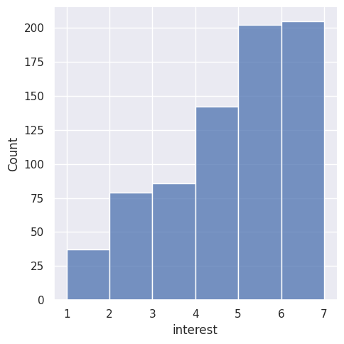
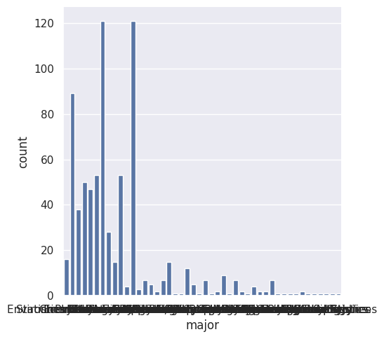
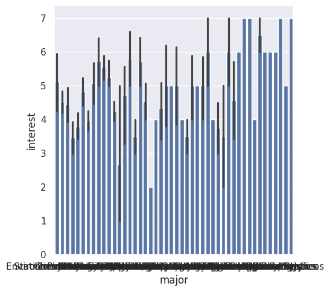

---
# Do not edit the text between these lines!
layout: default
---

# How non-cs majors are interested in connections to computer science

<!-- This is a comment. Below, you'll see code for inserting an image. To make this image appear, update <custom-path>. To add an image, save it inside the imgs folder of this repository. -->

## Analysis

For my analysis, I looked at the correlation between students in COMP 110 who are not computer science majors and their interest level in outside connections. I was able to sperate out students who were not cs majors from the major category and from there I could analyze their response to the interest in connections question. By seperating the data I was able to loop through the non-cs majors interest levels and get a count of how many students had an interest level greater than or equal to 5. This allowed me to gather the information that 407 students are non-cs majors and they also have an interest in outside connections of greater than or equal to 5. This represented 54% of non-cs majors. 

## Charts

## Conclusions

My reccomendation was to implement more exercises or lessons throughout the semester that show how cs can be connected to other fields to increase the interest of non-cs majors who may be in COMP 110. Through my analysis I found that 54.2% of non-cs majors have a high interst in outside connections of computer science. My data did not showed that a majority of non-cs majors have a high interest in outside connections. I believe that with an implementation of more exercises show how coding can be used for things outside of computer science could even lead to an increase in this percentage of students in the course. If the course were to implement more exercises or lessons like this it could lead to a negative impact of some students understanding of basic material if they were not given as many exercises or lessons that covered those because they would be replaced by ones that explore the outside connections. As a positive this could lead to more people taking further courses in computer science to explore the connections introduced in COMP 110. 